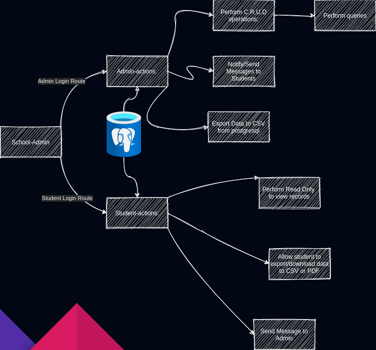

# Description 📝 
# Deadline 25/06/2021 22:35

The website is meant for school administrators to check on student fees, organise accounts and possibly store student grades. 

## Technical Specification 🔧
- The site is meant to use passportjs to authenticate credentials or perhaps run the postgresql database.
- With a different database running it should be able to store student records such as account balances like fees.
- The site is meant to use nodejs server in order to manage the webpages and otther possible libraries.

## RoadMap
- [x] Setup express to handle website.
- [x] Setup authentication and login with postgresql and passportjs.
- [x] Automatically refresh results using async.
- [x] When admin clicks new student it will bring the user/admin to a form to edit the details, whether current or new.
  - [ ] Fix update settings

## Database Controls
- [ ] Figure out how to send postgresql live.
- [x] Create records into postgresql via javascript functions.
- [x] Load all results from table.
	- [x] Can only display one value for now
- [ ] Edit/update records in postgresql.
- [x] Delete records in postgresql.
- [ ] Load results in batches and not all at once.

## Express
- [ ] Change from ejs to pug

## Design
- [ ] Use DrawIO to design and craft the UI interface before writing the code.
- [ ] The UI itself has to be user friendly for the user to help them use the system with ease.
	- [ ] Refer to the image that will be embedded in this document and to also make any additional changes.

## Bugs
- [ ] Throws error during reload of dashboard page.
- [x] Find a way to stay logged in even if user reloads/if nodemon reloads.
- [x] Fix a way to display all results from postgres instead of displaying current value
- [x] find a way to declare variables outside code and refactor it to look nice.
- [ ] Refactor the code better

